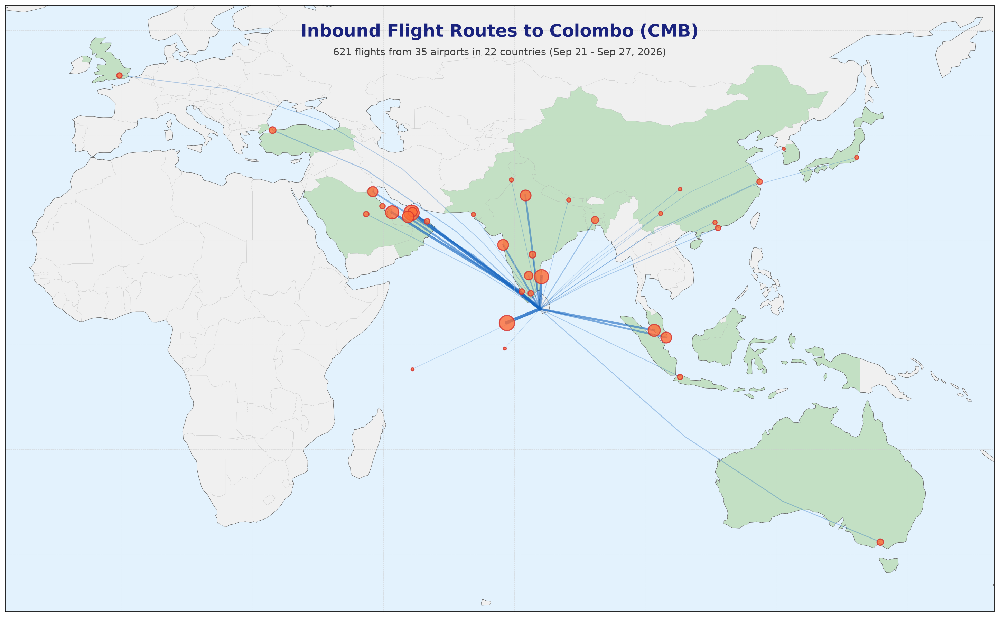

# Air Travel in 🇱🇰 Sri Lanka (lk_air_travel)




## Introduction

This repository provides automated tracking of inbound flight schedules to Colombo's Bandaranaike International Airport (CMB). Flight data is fetched from the official airport website and updated daily via GitHub Actions.

**Data Source:** <https://www.airport.lk>

**Note on Multi-Leg Flights:** For flights that make intermediate stops before arriving in Colombo (e.g., a flight from Dubai stopping in Male), the origin airport is recorded as the last stop before Colombo (Male), not the initial departure point (Dubai). This reflects the actual boarding location for the final leg to Colombo.

Each flight record includes:
- Flight number and airline
- Aircraft type
- Arrival time (Sri Lanka timezone)
- Origin airport with country and coordinates

### Example Flight Data

```json
{
  "flight_no": "TG307",
  "airline": "Thai Airways",
  "aircraft_type": "A320",
  "arrival_time": "2026-05-17 23:55",
  "airport_name": "Bangkok Suvarnabhumi",
  "country_name": "Thailand"
}
```

## Summary Statistics

**Scheduled flights for the week: 2026-05-11 to 2026-05-17**

- **586** total flights
- **45** origins
- **26** countries
- **29** airlines

## Airlines

| # | Airline | Flights/Week |
|---:|---------|-------------:|
| 1 | Srilankan Airlines | 245 |
| 2 | Indigo Airlines | 59 |
| 3 | Emirates | 28 |
| 4 | Etihad Airways | 27 |
| 5 | Fits Air | 25 |
| 6 | Qatar Airways | 21 |
| 7 | Air India | 21 |
| 8 | Air Arabia | 20 |
| 9 | Fly Dubai | 17 |
| 10 | Singapore Airlines | 14 |
| 11 | China Eastern | 11 |
| 12 | Turkish Airlines | 10 |
| 13 | Jazeera Airways | 9 |
| 14 | Gulf Air | 7 |
| 15 | Air Asia Berhad | 7 |
| 16 | THAI AIR ASIA | 7 |
| 17 | Malaysia Airlines | 7 |
| 18 | Cathay Pacific | 7 |
| 19 | Thai Airways | 7 |
| 20 | Air China | 6 |
| 21 | Chongqing Airlines | 6 |
| 22 | Salam Air | 5 |
| 23 | Air Arabia Abu Dhabi | 5 |
| 24 | Batik Air | 4 |
| 25 | Aeroflot | 4 |
| 26 | Air Seychelles | 2 |
| 27 | Saudi Arabian Airlines | 2 |
| 28 | Edelweiss Air | 2 |
| 29 | Kuwait Airways | 1 |

## Countries

| # | Country | Destinations | Flights/Week |
|---:|---------|-------------:|-------------:|
| 1 | 🇮🇳 India | 9 | 171 |
| 2 | 🇦🇪 United Arab Emirates | 3 | 103 |
| 3 | 🇲🇻 Maldives | 2 | 54 |
| 4 | 🇲🇾 Malaysia | 1 | 34 |
| 5 | 🇹🇭 Thailand | 2 | 28 |
| 6 | 🇸🇬 Singapore | 1 | 28 |
| 7 | 🇶🇦 Qatar | 1 | 24 |
| 8 | 🇨🇳 China | 5 | 24 |
| 9 | 🇸🇦 Saudi Arabia | 2 | 15 |
| 10 | 🇦🇺 Australia | 2 | 14 |
| 11 | 🇧🇩 Bangladesh | 1 | 12 |
| 12 | 🇰🇼 Kuwait | 1 | 10 |
| 13 | 🇹🇷 Turkey | 1 | 9 |
| 14 | 🇵🇰 Pakistan | 2 | 9 |
| 15 | 🇬🇧 United Kingdom | 1 | 7 |
| 16 | 🇮🇩 Indonesia | 1 | 7 |
| 17 | 🇭🇰 Hong Kong | 1 | 7 |
| 18 | 🇴🇲 Oman | 1 | 5 |
| 19 | 🇳🇵 Nepal | 1 | 4 |
| 20 | 🇯🇵 Japan | 1 | 4 |
| 21 | 🇷🇺 Russia | 1 | 4 |
| 22 | 🇩🇪 Germany | 1 | 3 |
| 23 | 🏳️ Unknown | 1 | 3 |
| 24 | 🇰🇷 South Korea | 1 | 3 |
| 25 | 🇸🇨 Seychelles | 1 | 2 |
| 26 | 🇨🇭 Switzerland | 1 | 2 |

## Inbound Locations

| # | Country | Origin | Flights/Week |
|---:|---------|--------|-------------:|
| 1 | 🇲🇻 Maldives | Male | 52 |
| 2 | 🇦🇪 United Arab Emirates | Dubai | 51 |
| 3 | 🇮🇳 India | Chennai | 49 |
| 4 | 🇲🇾 Malaysia | Kuala Lumpur | 34 |
| 5 | 🇮🇳 India | Delhi | 34 |
| 6 | 🇦🇪 United Arab Emirates | Abu Dhabi | 32 |
| 7 | 🇮🇳 India | Mumbai | 28 |
| 8 | 🇸🇬 Singapore | Singapore | 28 |
| 9 | 🇶🇦 Qatar | Doha | 24 |
| 10 | 🇮🇳 India | Bangalore | 23 |
| 11 | 🇹🇭 Thailand | Bangkok Suvarnabhumi | 21 |
| 12 | 🇦🇪 United Arab Emirates | Sharjah | 20 |
| 13 | 🇧🇩 Bangladesh | Dhaka | 12 |
| 14 | 🇮🇳 India | Hyderabad Intl | 11 |
| 15 | 🇰🇼 Kuwait | Kuwait | 10 |
| 16 | 🇹🇷 Turkey | Istanbul Ataturk | 9 |
| 17 | 🇸🇦 Saudi Arabia | Dammam | 8 |
| 18 | 🇮🇳 India | Tiruchirappalli | 8 |
| 19 | 🇦🇺 Australia | Sydney | 7 |
| 20 | 🇸🇦 Saudi Arabia | Riyadh | 7 |
| 21 | 🇬🇧 United Kingdom | London-Heathrow | 7 |
| 22 | 🇮🇳 India | Madurai | 7 |
| 23 | 🇮🇳 India | Cochin | 7 |
| 24 | 🇮🇩 Indonesia | Jakarta | 7 |
| 25 | 🇨🇳 China | Shanghai | 7 |
| 26 | 🇹🇭 Thailand | Bangkok Don Mueang | 7 |
| 27 | 🇦🇺 Australia | Melbourne | 7 |
| 28 | 🇭🇰 Hong Kong | Hong Kong | 7 |
| 29 | 🇨🇳 China | Chengdu-Tianfu | 6 |
| 30 | 🇴🇲 Oman | Muscat | 5 |
| 31 | 🇵🇰 Pakistan | Lahore | 5 |
| 32 | 🇵🇰 Pakistan | Karachi | 4 |
| 33 | 🇮🇳 India | Thiruvananthapuram | 4 |
| 34 | 🇳🇵 Nepal | Kathmandu | 4 |
| 35 | 🇨🇳 China | Kunming | 4 |
| 36 | 🇨🇳 China | Guangzhou Baiyun | 4 |
| 37 | 🇯🇵 Japan | Narita | 4 |
| 38 | 🇷🇺 Russia | Sheremetyevo | 4 |
| 39 | 🇩🇪 Germany | Frankfurt Main | 3 |
| 40 | 🏳️ Unknown | Ahmedabad Intl | 3 |
| 41 | 🇰🇷 South Korea | Incheon | 3 |
| 42 | 🇨🇳 China | Chongqing | 3 |
| 43 | 🇸🇨 Seychelles | Seychelles | 2 |
| 44 | 🇲🇻 Maldives | Gan Intl | 2 |
| 45 | 🇨🇭 Switzerland | Zurich Intl | 2 |

---


[](https://opensource.org/licenses/MIT)
